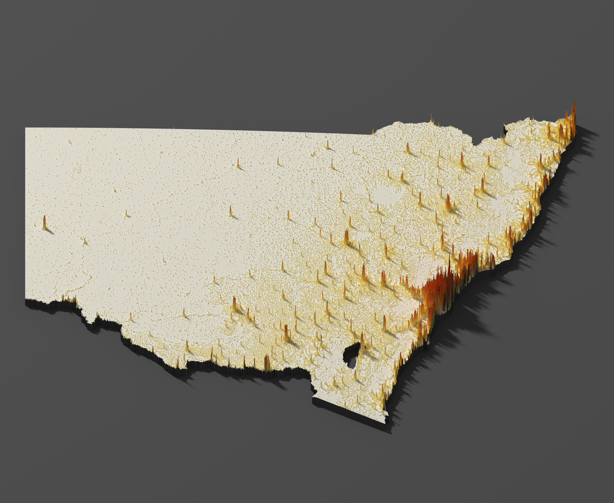
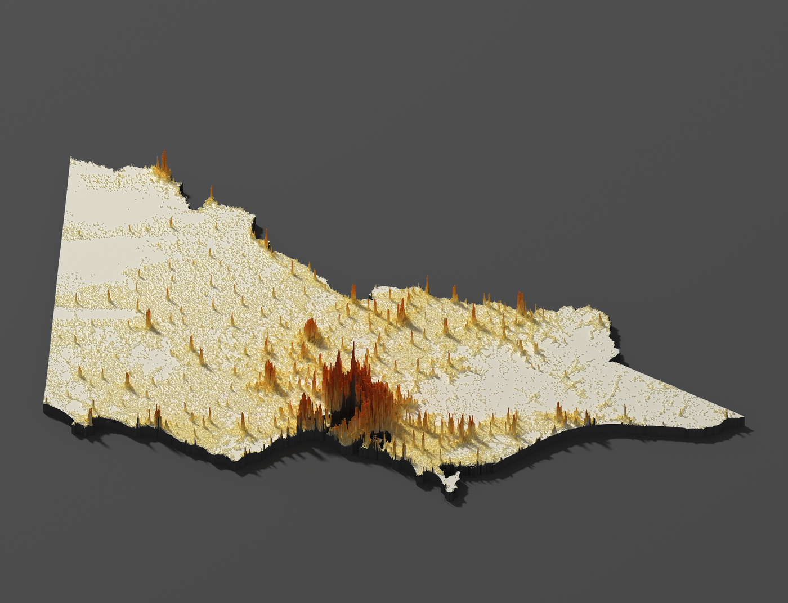
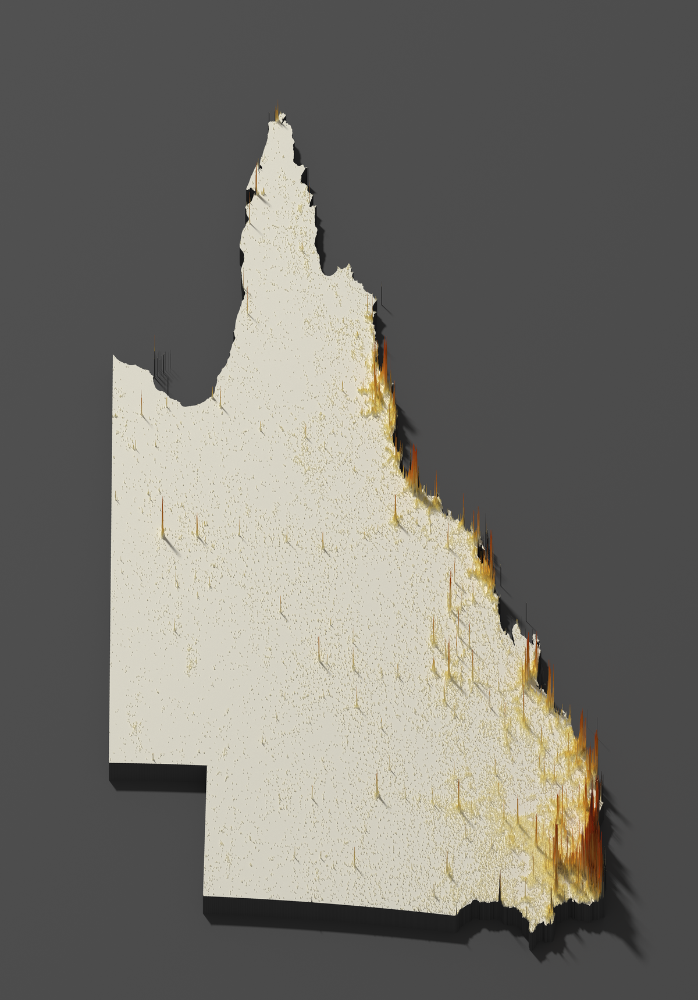
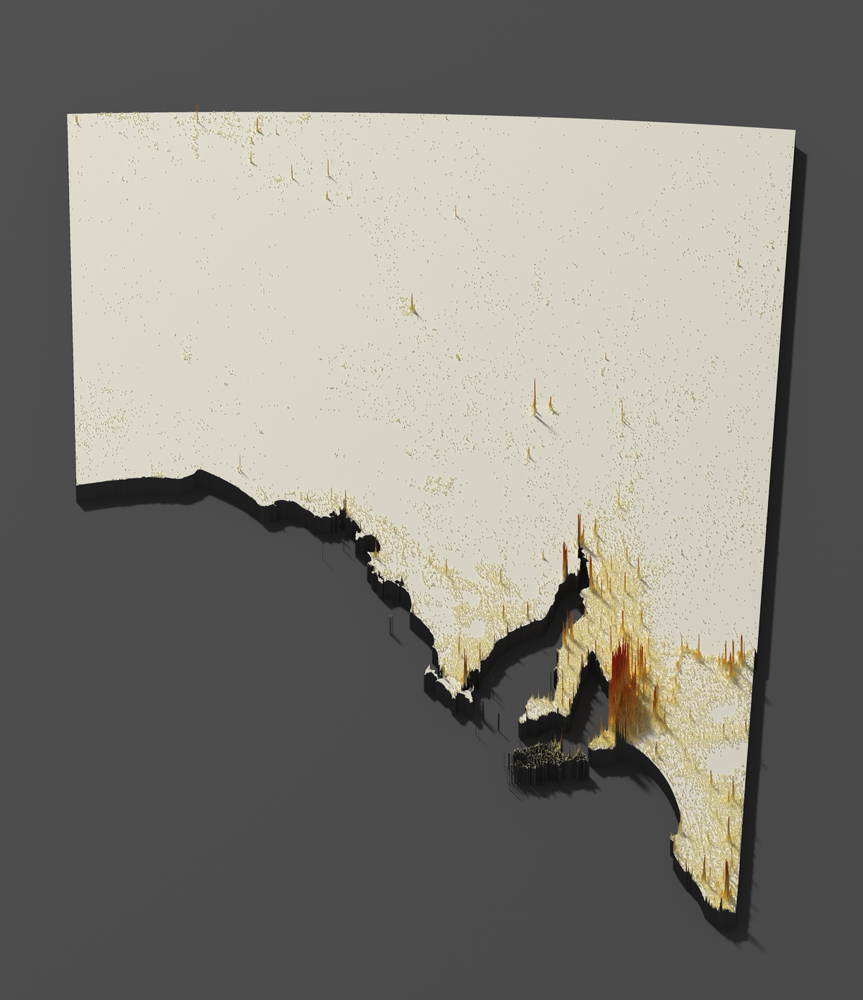
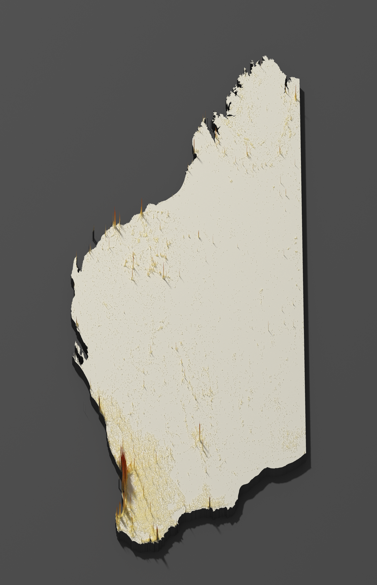
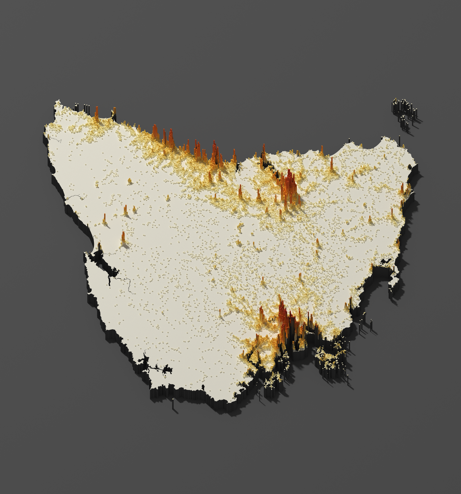
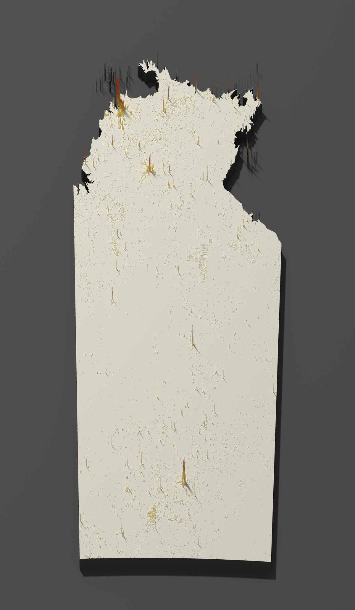
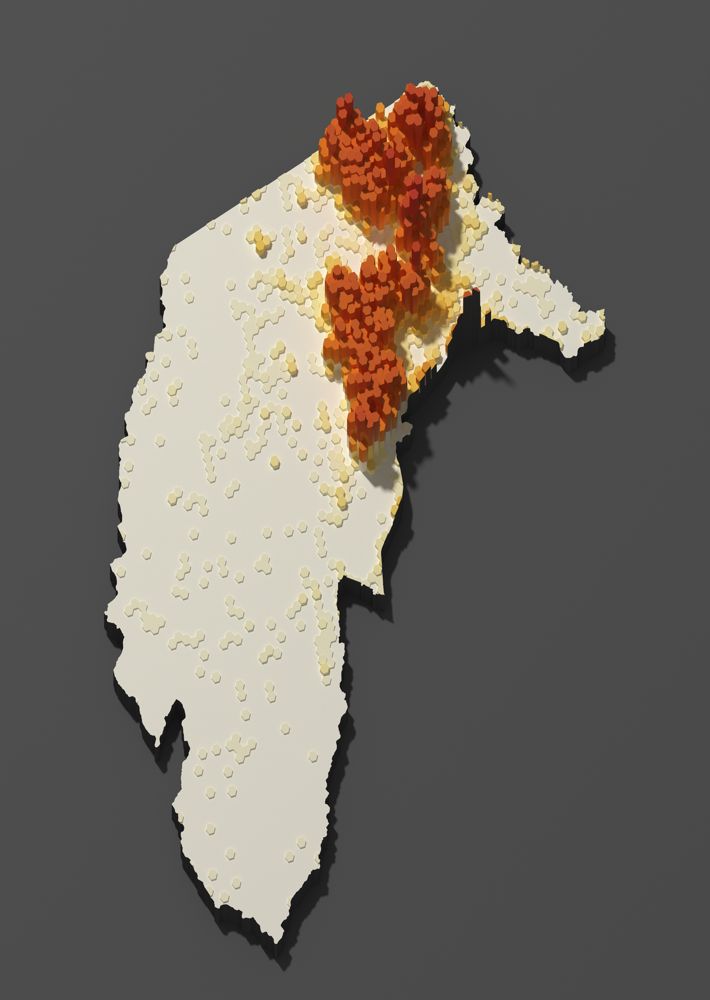

# TerraR: Australian Population Spike Maps

3D population spike maps of Australia's states and territories, rendered in R using rayshader and rayrender.

Each map shows population density as spikes on an elevated platform. Rendered at 5000 px · 2048 samples · sobol path tracing.

[](LICENSE) &nbsp;&nbsp; [⬇ Download full-resolution renders (v0.1)](https://github.com/julian-chung/TerraR/releases/tag/v0.1)

---

## Gallery

<table>
  <tr>
    <td></td>
    <td></td>
  </tr>
  <tr>
    <td align="center"><em>New South Wales</em></td>
    <td align="center"><em>Victoria</em></td>
  </tr>
  <tr>
    <td></td>
    <td></td>
  </tr>
  <tr>
    <td align="center"><em>Queensland</em></td>
    <td align="center"><em>South Australia</em></td>
  </tr>
  <tr>
    <td></td>
    <td></td>
  </tr>
  <tr>
    <td align="center"><em>Western Australia</em></td>
    <td align="center"><em>Tasmania</em></td>
  </tr>
  <tr>
    <td></td>
    <td></td>
  </tr>
  <tr>
    <td align="center"><em>Northern Territory</em></td>
    <td align="center"><em>Australian Capital Territory</em></td>
  </tr>
</table>

---

## How it works

Population data from the [Kontur](https://kontur.io) 400m hexagonal grid is clipped to each state boundary and rasterized into a height matrix.

The state platform is built by rasterizing the ABS boundary as a mask and raising all within-state cells to a fixed base elevation. Offshore islands (e.g. Lord Howe Island) are excluded by selecting only the largest polygon from each state's boundary geometry, which keeps the frame centred on the mainland.

Rendering uses `rayrender`, a CPU-based path tracer. At 5000px, each image is approximately 20 megapixels.

---

## Data sources

**[Kontur Population Dataset](https://data.humdata.org/dataset/kontur-population-australia)**
400m hexagonal population grid for Australia by Kontur. Download the GeoPackage and place it at `data/raw/kontur_population_AU_20231101.gpkg`.

**[ABS State and Territory Boundaries](https://www.abs.gov.au/statistics/standards/australian-statistical-geography-standard-asgs-edition-3/jul2021-jun2026/access-and-downloads/digital-boundary-files)**
2021 Census digital boundary files from the Australian Bureau of Statistics. Included in `data/boundaries/`.

---

## How to reproduce

**Prerequisites**

- R ≥ 4.1
- Packages: `tidyverse`, `sf`, `stars`, `rayshader`, `rayrender`, `rgl`
- The Kontur population GeoPackage (see Data sources) and the ABS state and territory boundary files.

**Steps**

```r
# Step 1: Clip and cache state population data
# This runs st_intersection() across all states — expect 10+ hours on first run.
# The result is cached to data/processed/state_pops.rds.
source("R/01_prepare_data.R")

# Step 2 (optional): Tune camera settings interactively for a specific state
source("R/03_tune_camera.R")

# Step 3: Render spike maps for all states and territories
# Comment out individual state blocks in the script to re-run a single state.
source("R/02_render_maps.R")
```

Output images are saved to `outputs/images/` as `state-spike-map-{State-Name}.png`.

> **Note:** `data/processed/state_pops.rds` is not included in this repository — it is generated by `01_prepare_data.R` and excluded from version control due to size. The `st_intersection()` clipping step is the main bottleneck: It took approximately 12-14 hours on an M1 Max MacBook Pro. The result is cached so you only need to do this once.

**Resource requirements**

Rendering at 5000 px is CPU and memory intensive. Each state render peaks at approximately 35 GB RAM and saturates all available CPU cores for several hours. The full 8-state batch took approximately 16 hours. These renders were produced on a Ryzen 9 7950X3D (16 cores / 32 threads, 64 GB RAM).

---

## Project structure

```
R/
  01_prepare_data.R     — clip Kontur hexagons to state boundaries, cache result
  02_render_maps.R      — batch renderer: one spike map per state/territory
  03_tune_camera.R      — interactive camera tuning script (run in RStudio)
  04_export_web_assets.R — downscale renders for README and web use

data/
  boundaries/           — ABS state boundary shapefiles (included)
  processed/            — cached state population data (gitignored, generated locally)
  raw/                  — Kontur GeoPackage (gitignored, download separately)

outputs/
  images/               — full-resolution rendered PNGs (gitignored)

assets/                 — downscaled images for README and web (committed)
```

---

## Credits

The spike map technique is adapted from Milos Popovic's tutorial
[*Making crisp spike maps with R*](https://github.com/milos-agathon/spike-maps) (2023).

The Australian adaptation adds:
- A two-source data pipeline combining Kontur population data with ABS state boundaries
- Per-state rasterization with mainland-only polygon extraction
- Decoupled height and colour matrices (`sqrt` for geometry, `log10` for colour)
- Per-state tuned camera settings and a path-traced tuning preview workflow
